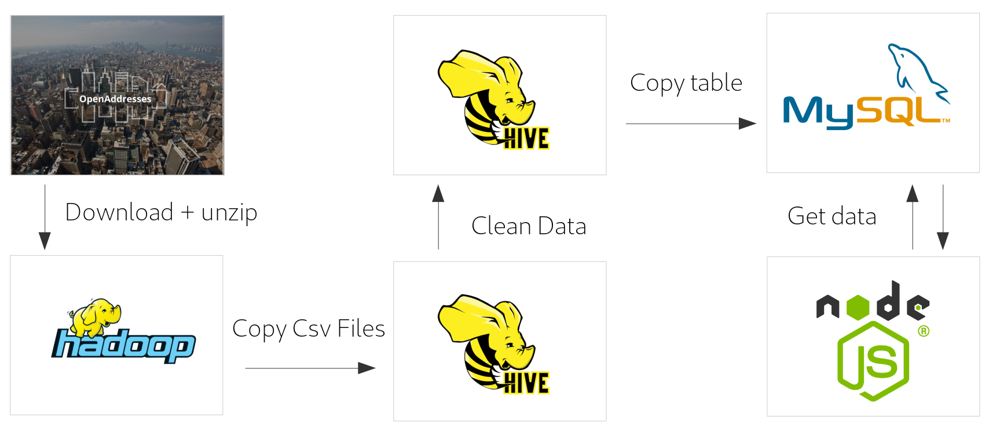

# Big-Bata

## Aufgabenstellung

Mit dem folgenden Workflow soll es möglich werden, Addressen anhand der von OpenAddresses.io
bereitgestellten Daten zu validieren. 

Die Address-Daten können als Zip-Datei heruntergeladen werden,
deren Inhalt in den folgenden Abbildungen dargestellt wird.

 

Um Addressen anhand dieser Daten validieren zu können,
soll der folgende Workflow realisiert werden:

* Sammeln von Daten aus OpenAddresses.io
* Speicherung der Rohdaten (CSV-Dateien) in HDFS (nach Ländern gegliedert)
* Optimierung, Reduzierung und Bereinigung der Rohdaten
* Exportierung der Adressdaten in eine Endbenutzerdatenbank (z.B. MySQL,MongoDB....)
* Bereitstellung eines einfachen HTML-Frontends:
  * aus der Endbenutzerdatenbank lesen
  * Benutzereingaben verarbeiten (Straße, Ort, Postleitzahl....)
  * Validierung von Benutzereingaben anhand von OpenAddress-Daten am Ende des Vorgangs.
  * Anzeigen des Ergebnisses (echte oder nicht echte Adresse)
* Der gesamte Daten-Workflow muss innerhalb eines ETL Workflow-Tools (Airflow/Pentaho) implementiert und automatisch ausgeführt werden.

## Umsetzung

### ETL Workflow

Der ETL-Workflow wird mit dem Tool Airflow realisiert.
Er implementiert dabei den im Folgenden dargestellten Ablauf

* Herunterladen der Address-Daten als Zip-Datei und entpacken.

* Kopieren der relevanten Daten (nur Csv-Dateien und Länder-Ordner) ins HDFS

* Extrahieren der nötigen Daten in eine neue Hive-Tabelle (Land,Stadt,Postleitzahl,Straße,Hausnummer)

* Exportieren der Hive-Tabelle in eine MySql-Datenbank

* Validierung der Daten durch eine NodeJs-Webseite mit Zugriff auf die MySql-Datenbank

### Airflow Tasks

Im Folgenden werden die jeweiligen Airflow Tasks beschrieben, mit welchen der o.g. Ablauf implementiert wird

Task | Beschreibung
----------- | -------
rm_local_import_dir | löscht den import Ordner falls vorhanden
create_local_import_dir | erstellt einen neuen import ordner
download_address_data | Lädt sie Daten als Zip-datei herunter
unzip_adress_data | Entpackt die Zip-Datei
create_hive_table_address_data | erstellt eine Hive Tabelle für die Address Daten, die nach Jahr,Monat,Tag,Land partitioniert ist
create_hdfs_address_data_dir_X | erstellt für jedes Land einen Ordner im HDFS
dummy0 | wartet bis alle Ordner erstellt wurden
hdfs_put_address_data_X | Kopiert alle Csv-Dateien aus jedem Land Ordner in den jeweiligen HDFS Ordner
dummy1 | wartet, bis alle Daten ins HDFS kopier wurden
hive_add_partition_address_data_X | Fügt den Inhalt jedes Land Ordners als partition in die Hive-Tabelle ein
dummy2 | wartet, bis alle partitionen zur Hive-Tabelle hinzugefügt wurden sind
create_hive_table_final_address_data | erstellt eine Tabelle, die die bereinigten Daten beinhalten wird
hive_insert_overwrite_final_address_data | kopiert die spalten Country,City,Postcode,Street,Number,Hash ind die finale Tabelle
create_table_remote | erstellt eine neue tabelle in der Mysql datenbank für die bereinigten Daten falls noch nicht 
delete_from_remote | löscht alle alten daten aus der tabelle falls vorhanden
hive_to_mysql_X | kopiert alle Daten aus der Hive tabelle nacheinander nach Ländern in die sqm tabelle  

